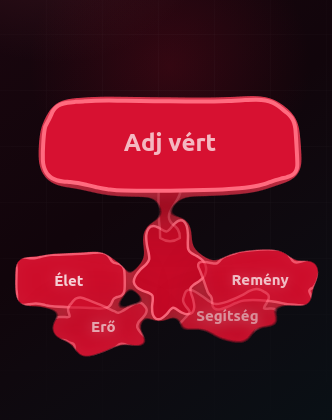

# 🩸 Liquid Blood Menu

An experimental UI concept where a dark, organic blood blob transforms into an interactive navigation menu.

Instead of opening a traditional dropdown, the interface behaves like a living material. Pull the blob down, watch a blood drop stretch, detach, and morph into a floating menu.

> This project is an exploration of fluid user interfaces built with nothing more than HTML, CSS, SVG and vanilla JavaScript.

---

## ✨ Features

* Organic blood blob interaction
* Gooey SVG metaball effect
* Elastic drag animation
* Dynamic bridge between blob and drop
* Blood drop detachment
* Morphing floating menu
* Mobile touch support
* State machine driven interaction
* Smooth 60 FPS animations
* Background blur overlay
* Escape key and outside-click close

---

## 🛠 Technologies

* HTML5
* CSS3
* Vanilla JavaScript
* SVG Filters

  * `feGaussianBlur`
  * `feColorMatrix`
* Pointer Events API

No frameworks.
No dependencies.
No build process.

---

## 🎮 Interaction

1. Touch or click the blood blob at the top of the screen.
2. Drag downward.
3. If the drag distance is too short, the blob snaps back.
4. Drag past the threshold and the blood drop stretches from the blob.
5. The bridge narrows until the drop detaches.
6. The detached drop morphs into a floating navigation menu.
7. Click outside the menu or press **Esc** to close it.

---

## 📱 Mobile Support

Designed primarily for touch devices.

Optimizations include:

* Pointer Events
* Disabled tap highlight
* Disabled text selection
* Controlled touch actions
* Responsive layout

---

## 🚀 Live Demo

https://ztbit24.github.io/liquid-blood-menu/

---

## 📷 Preview

---

## 🎯 Project Goals

This is not intended to become a production navigation component.

The purpose of the project is to experiment with:

* fluid interfaces
* organic interaction design
* procedural animation
* SVG gooey effects
* unconventional UI concepts

---

## 💡 Future Ideas

* Physics-based metaballs
* Multi-drop interaction
* Dynamic menu generation
* Sound effects
* Haptic feedback
* Theme customization
* WebGL version
* Three.js implementation

---

## 📄 License

MIT License
